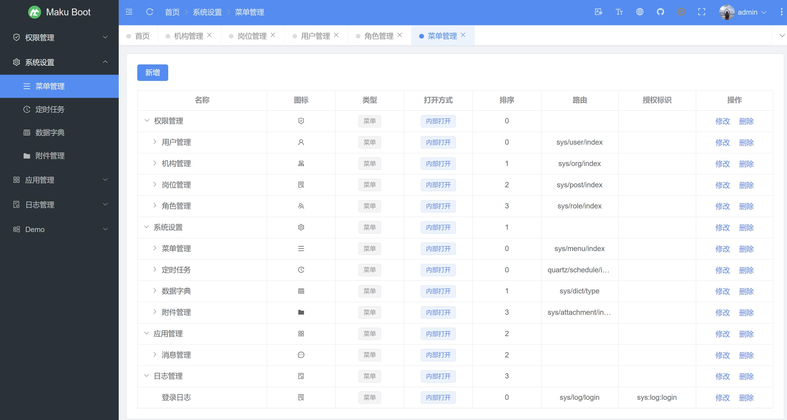

## 项目说明

- maku-boot
  是采用SpringBoot3.0、SpringSecurity6.0、Mybatis-Plus等框架，开发的一套SpringBoot低代码开发平台，使用门槛极低，且采用MIT开源协议，完全免费开源，可免费用于**
  商业项目**等场景。
- 采用组件模式，扩展不同的业务功能，可以很方便的实现各种业务需求，且不会导致系统臃肿，若想使用某个组件，按需引入即可，反之亦然。
- 支持Online在线表单开发，可快速开发业务，无需部署及重启服务等优点。
- 前端工程：https://gitee.com/makunet/maku-admin
- 开发文档：[https://maku.net/docs/maku-boot](https://maku.net/docs/maku-boot)
- 演示环境：https://demo.maku.net/maku-boot
- 官网地址：https://maku.net

## 微信交流群

为了更好的交流，我们新提供了微信交流群，需扫描下面的二维码，关注公众号，回复【加群】，根据提示信息，作者会拉你进群的，感谢配合！

## 开源汇总
- 低代码开发平台（单体版）：https://gitee.com/makunet/maku-boot
- 低代码开发平台（微服务）：https://gitee.com/makunet/maku-cloud
- 超好用的代码生成器：https://gitee.com/makunet/maku-generator
- Vue3.x 后台管理UI：https://gitee.com/makunet/maku-admin
- Vue3.x 表单设计器：https://gitee.com/makunet/maku-form-design

## 支持

如果觉得框架还不错，或者已经在使用了，希望你可以去 [Github](https://github.com/makunet/maku-boot)
或 [Gitee](https://gitee.com/makunet/maku-boot) 帮作者点个 ⭐ Star，这将是对作者极大的鼓励与支持。

## 架构图

## 效果图

