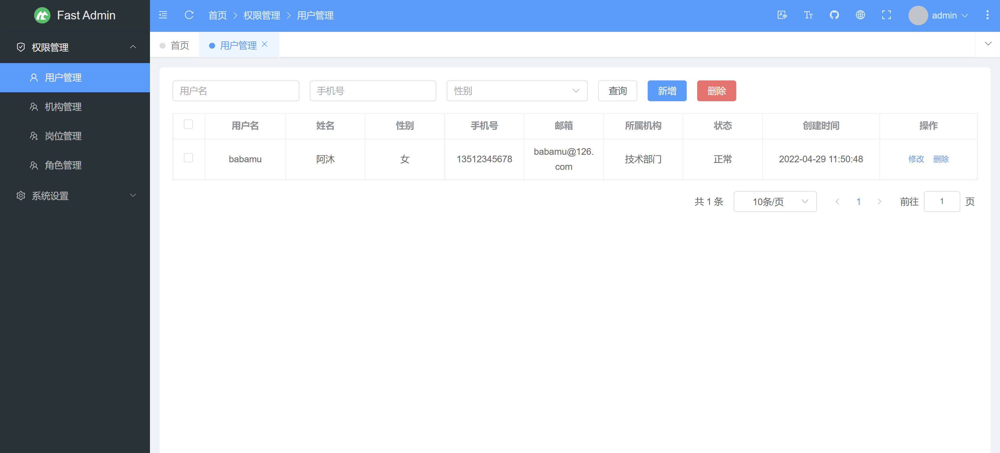
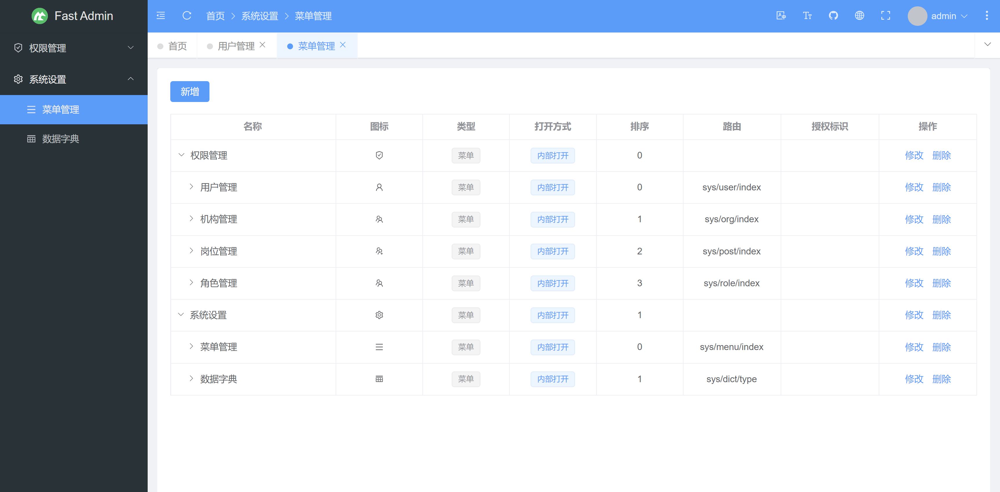
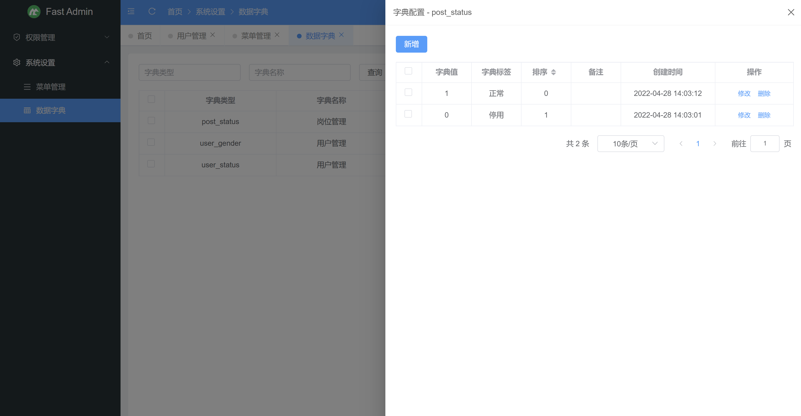
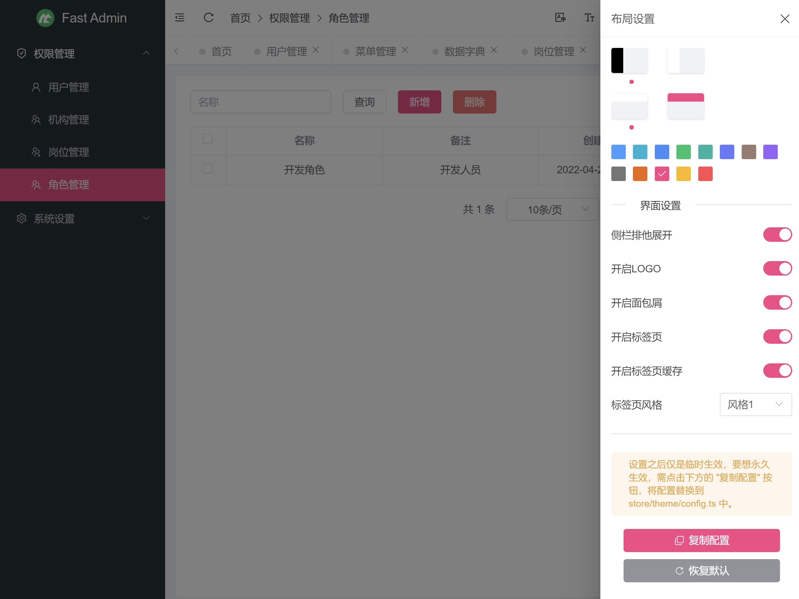
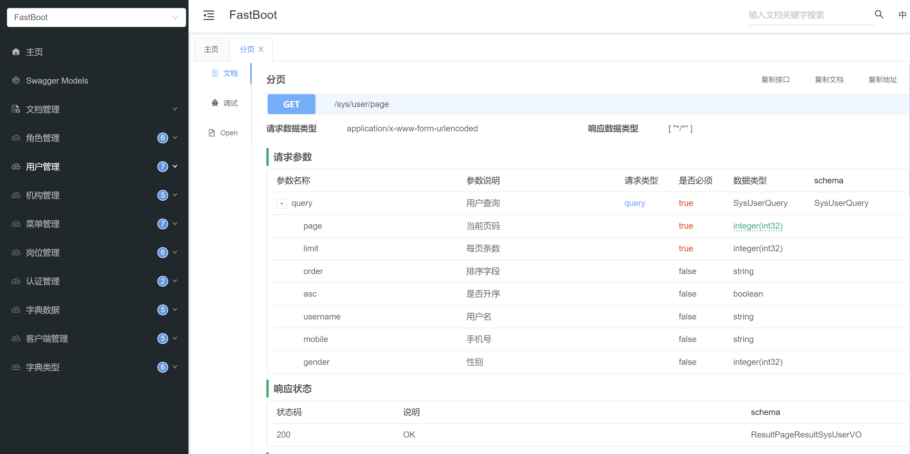

## 项目说明
- FastBoot是采用SpringBoot、SpringSecurity、Mybatis-Plus等框架，开发的一套SpringBoot快速开发系统，使用门槛极低，且采用MIT开源协议，完全免费开源，可免费用于**商业项目**等场景。
- 前端工程：[https://gitee.com/makunet/fast-admin](https://gitee.com/makunet/fast-admin)
- 代码生成器：[https://gitee.com/makunet/fast-generator](https://gitee.com/makunet/fast-generator)
- 开发文档：[https://maku.net/docs/fast-boot](https://maku.net/docs/fast-boot)

## 演示环境
演示地址：https://demo.maku.net/fast-boot

## 环境搭建
- 下载项目源码，一般通过git clone命令
- idea、eclipse需安装lombok插件，不然会提示找不到get set方法
- 创建数据库fast_boot，数据库编码为utf8mb4
- 执行db/mysql.sql文件，初始化数据库脚本
- 修改application-dev.yml文件，配置MySQL、Redis账号信息
- 在fast-boot目录下，执行mvn clean install

## 本地启动
- 在fast-server工程里面，运行ServerApplication.java，则可启动项目
- 接口文档路径：http://localhost:8080/doc.html
- 再启动前端项目：https://gitee.com/makunet/fast-admin
- 账号密码：admin/admin

## 交流和反馈
- 官方社区：https://maku.net
- Github仓库：https://github.com/makunet/fast-boot
- Gitee仓库：https://gitee.com/makunet/fast-boot
- 技术解答、交流、反馈、建议等，请移步到官方社区，我们会及时回复，也方便今后的小伙伴寻找答案，感谢理解！

## 微信交流群
为了更好的交流，我们新提供了微信交流群，需扫描下面的二维码，关注公众号，回复【加群】，根据提示信息，作者会拉你进群的，感谢配合！

## 支持
如果觉得框架还不错，或者已经在使用了，希望你可以去 [Github](https://github.com/makunet/fast-boot) 或 [Gitee](https://gitee.com/makunet/fast-boot) 帮作者点个 ⭐ Star，这将是对作者极大的鼓励与支持。

## 效果图

