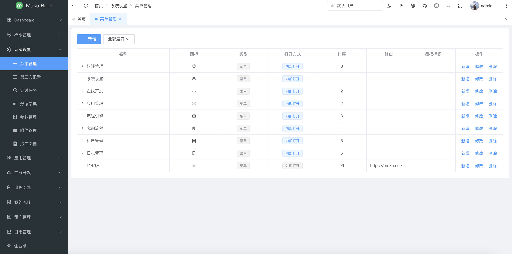
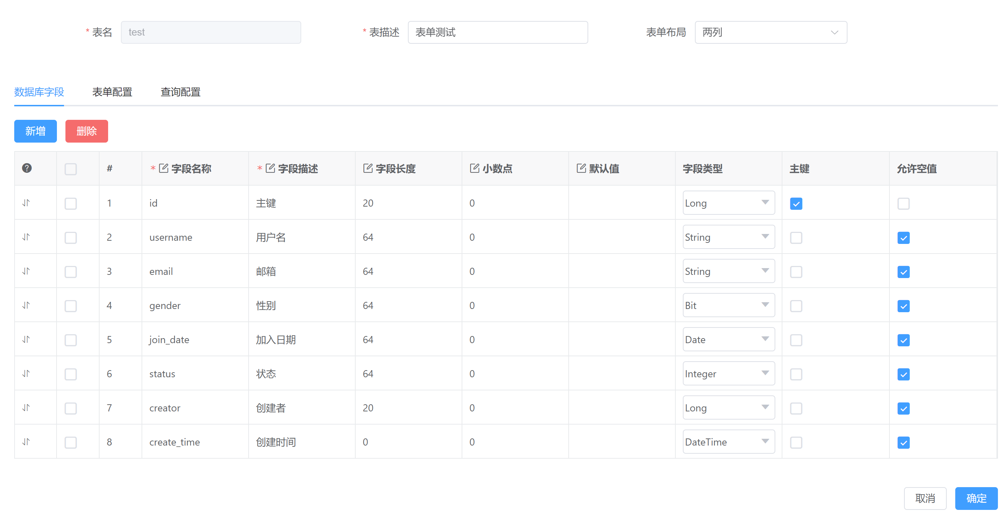
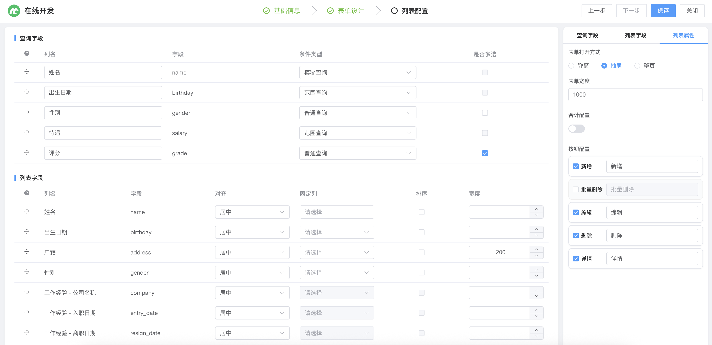
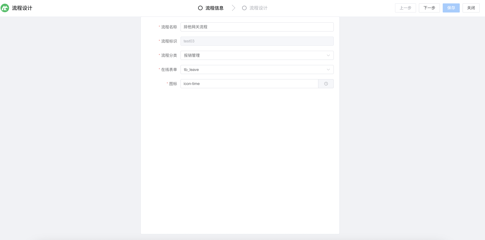
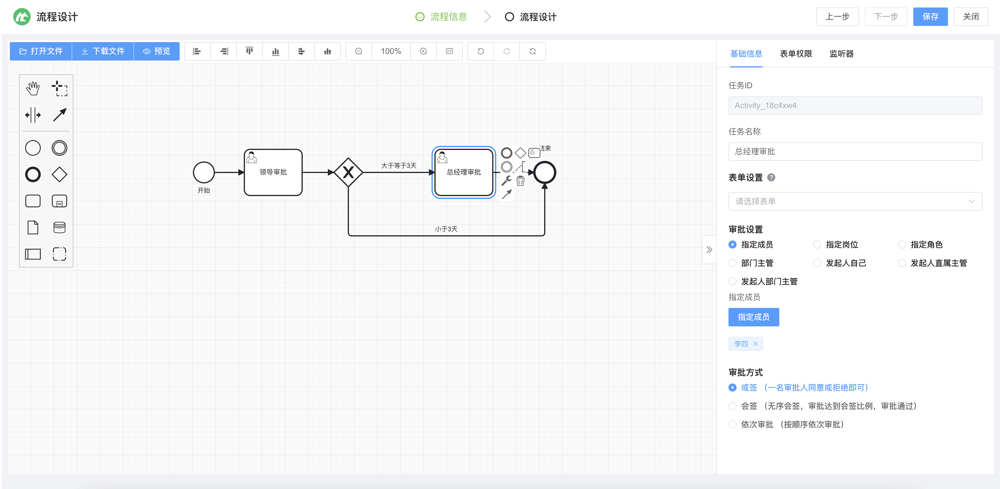
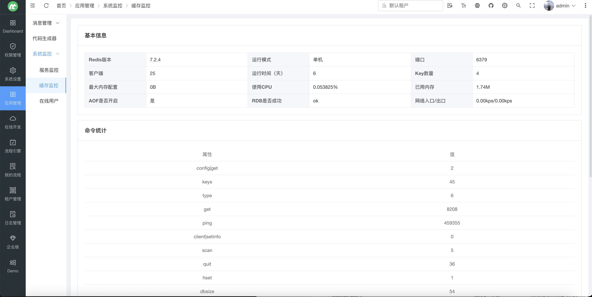
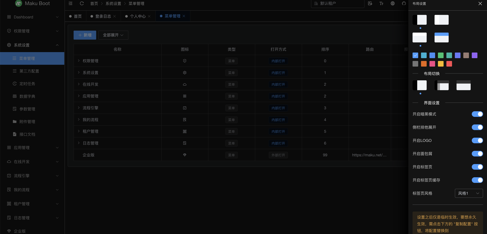
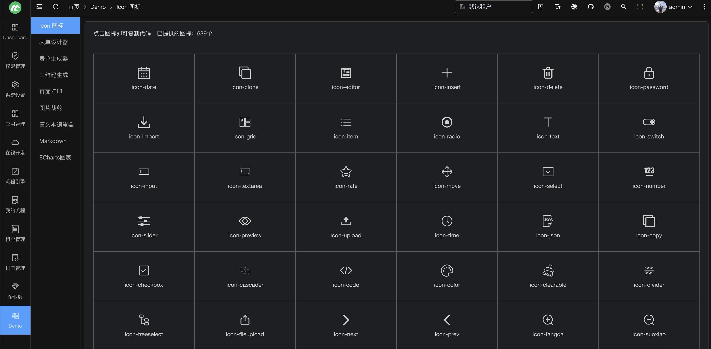

## 项目说明

- maku-boot 是采用SpringBoot3.3、SpringSecurity6.3、Mybatis-Plus、Flowable7.0、Vue3、Element-plus等技术开发的低代码开发平台，旨在为开发者提供一个简洁、高效、可扩展的低代码开发平台。
- 使用门槛极低，支持国密加密、达梦数据库等，符合信创需求的低代码开发平台。
- 采用组件模式，扩展不同的业务功能，可以很方便的实现各种业务需求，且不会导致系统臃肿，若想使用某个组件，按需引入即可，反之亦然。
- 支持Online在线表单开发，支持单表、树表、一对一、一对多表单，可快速开发业务，无需部署及重启服务等优点。
- 支持多种数据库，包括MySQL、PostgreSQL、达梦等，可灵活切换。
- 支持Flowable7工作流，包括流程设计、自定义表单、在线Online表单、会签、或签等。
- 支持多种登录方式，包括账号密码、短信验证码、企业微信、钉钉、飞书、微信等，可灵活选择。
- 支持多租户模式，可实现不同业务系统之间的隔离，能同时支持字段隔离、数据源隔离方式，满足对多租户的全部需求。

- 前端工程：https://gitee.com/makunet/maku-admin
- 开发文档：https://maku.net/docs/maku-boot
- 演示环境：https://demo.maku.net/maku-boot
- 授权地址：https://maku.net/p/10096
- 企业版：https://maku.net/price

## 微信交流群

为了更好的交流，我们新提供了微信交流群，需扫描下面的二维码，关注公众号，回复【加群】，根据提示信息，作者会拉你进群的，感谢配合！

## 开源汇总
- 低代码开发平台（单体版）：https://gitee.com/makunet/maku-boot
- 低代码开发平台（微服务）：https://gitee.com/makunet/maku-cloud
- 超好用的代码生成器：https://gitee.com/makunet/maku-generator
- Vue3.x 后台管理UI：https://gitee.com/makunet/maku-admin
- Vue3.x 表单设计器：https://gitee.com/makunet/maku-form-design

## 支持

如果觉得框架还不错，或者已经在使用了，希望你可以去 [Github](https://github.com/makunet/maku-boot)
或 [Gitee](https://gitee.com/makunet/maku-boot) 帮作者点个 ⭐ Star，这将是对作者极大的鼓励与支持。

## 架构图

## 效果图

<table>
    <tr>
        <td></td>
        <td></td>
    </tr>
    <tr>
        <td></td>
        <td></td>
    </tr>
    <tr>
        <td></td>
        <td></td>
    </tr>
    <tr>
        <td></td>
        <td></td>
    </tr>
    <tr>
        <td></td>
        <td></td>
    </tr>
    <tr>
        <td></td>
        <td></td>
    </tr>
    <tr>
        <td></td>
        <td></td>
    </tr>
    <tr>
        <td></td>
        <td></td>
    </tr>
    <tr>
        <td></td>
        <td></td>
    </tr>
    <tr>
        <td></td>
        <td></td>
    </tr>
</table>